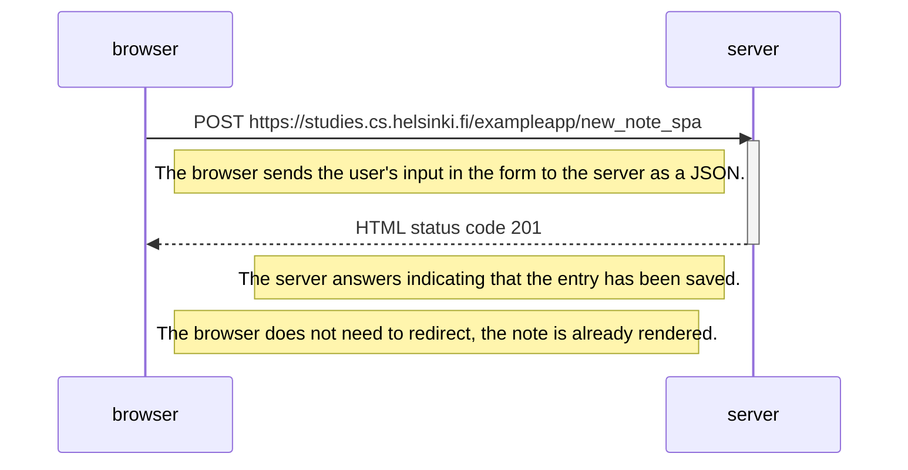

```mermaid
sequenceDiagram
    participant browser
    participant server

    browser->>server: POST https://studies.cs.helsinki.fi/exampleapp/new_note_spa
    activate server    
    Note right of browser: The browser sends the user's input in the form to the server as a JSON.
    server-->>browser: HTML status code 201
    deactivate server
    Note left of server: The server answers indicating that the entry has been saved.
    Note right of browser: The browser does not need to redirect, the note is already rendered.
```
